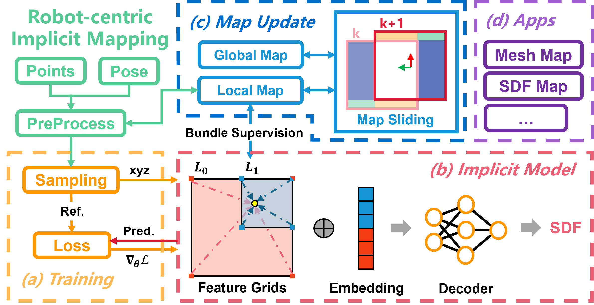

# Towards Large-Scale Incremental Dense Mapping using Robot-centric Implicit Neural Representation

## 1. Introduction

<div align="center"></div>

Robot-centric Implicit Mapping (RIM) is designed for large-scale incremental dense mapping. 
This method employs a hybrid representation, encoding shapes with implicit features via a multi-resolution voxel map and decoding signed distance fields through a shallow MLP. 
We advocate for a robot-centric local map to boost model training efficiency and curb the catastrophic forgetting issue. 
A decoupled scalable global map is further developed to archive learned features for reuse and maintain constant video memory consumption.

Authors: [Jianheng Liu](https://github.com/jianhengLiu), and [Haoyao Chen](https://github.com/HitszChen) from the [Networked RObotics and Sytems Lab](http://www.nrs-lab.com), [HITSZ](https://www.hitsz.edu.cn/index.html)

[[Paper](https://arxiv.org/pdf/2306.10472.pdf)][[Bilibili](https://www.bilibili.com/video/BV1iM4y1n78d/?share_source=copy_web&vd_source=98e0b0102bbc355156eba6f968dc7cfb)][[Youtube](https://youtu.be/sHJ4lju6hsk)]

If you use RIM for your academic research, please cite the following paper. 
```
@inproceedings{liu2024towards,
  title={Towards Large-Scale Incremental Dense Mapping using Robot-centric Implicit Neural Representation},
  author={Liu, Jianheng and Chen, Haoyao},
  booktitle={2024 IEEE International Conference on Robotics and Automation (ICRA)},
  pages={4045--4051},
  year={2024},
  organization={IEEE}
}
```

## 2. Installation
Tested on Ubuntu 20.04, ROS Noetic

- We use RVIZ for visualization for now. Please install ROS Noetic following the [official guide](http://wiki.ros.org/noetic/Installation/Ubuntu).
- Mesh tools
  ```bash
  sudo apt install ros-noetic-mesh-tools
  ```
- Dependencies
  ```bash
  sudo apt-get install libdw-dev
  ```
- RIM
  ```bash
  mkdir -p rimv2_ws/src
  cd rimv2_ws/src
  git clone https://github.com/HITSZ-NRSL/RIM.git --recursive

  # LibTroch: https://pytorch.org/get-started/locally/
  # Tested on: 
  # - CUDA/Torch: 11.3/1.13.0, 11.8/2.0.0
  wget https://download.pytorch.org/libtorch/cu118/libtorch-cxx11-abi-shared-with-deps-2.0.0%2Bcu118.zip
  # for other cuda version use the following command to download the corresponding version of libtorch(cuda11.3 for example):
  # wget https://download.pytorch.org/libtorch/nightly/cu113/libtorch-cxx11-abi-shared-with-deps-latest.zip
  unzip -d RIM/rim/thirdparty libtorch-cxx11-abi-shared-with-deps-*.zip

  cd ..
  catkin_make
  ```

## 3. Data Preparation

- Dependencies
  ```bash
  pip install open3d==0.18.0
  ```

### 3.1. Replica

```bash
sh src/RIM/scripts/data_download/download_replica.sh
sh src/RIM/scripts/data_convert/convert_replica_to_kitti_format.sh src/RIM/data/Replica
```

### 3.2. MaiCity

```bash
sh src/RIM/scripts/data_download/download_maicity.sh
```

## 4. Usage

```bash
roscore
source devel/setup.zsh
# source devel/setup.bash

rosrun neural_slam neural_slam_node src/RIM/rim/config/replica/replica.yaml src/RIM/data/Replica/room1_kitti_format

# online visualization
roslaunch neural_slam rviz.launch
```
Press `s` + `Enter` to output mesh.


# 5. Visualization

```bash
python src/RIM/scripts/visualization/mesh_viewer.py --view_config_file src/RIM/scripts/config/replica/room1.txt --mesh_file src/RIM/data/Replica/room1_mesh.ply
```
- `ctrl`+`9`: vis normal
- `ctrl`+`p`: save screenshot to the current directory

# 6. Acknowledgement
Thanks for great repositories including [NICE-SLAM](https://github.com/cvg/nice-slam) and [SHINE-Mapping](https://github.com/PRBonn/SHINE_mapping), sharing scripts for dataset downloading and metrics evaluation.
